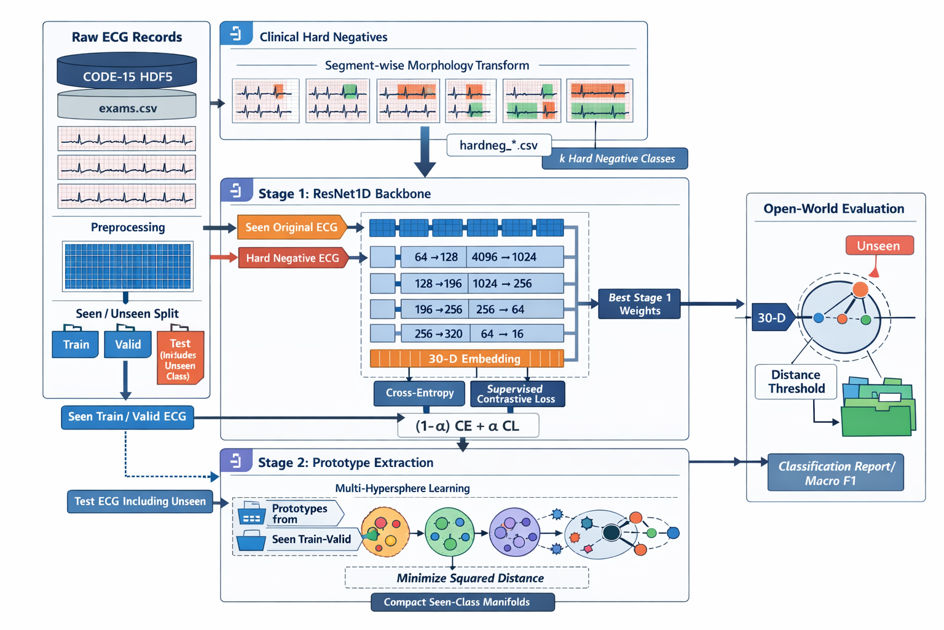

# Open-ECG

面向 CODE-15 心电数据的开放世界（open-world）ECG 异常分类实验代码。项目目标不是只在训练中出现过的类别之间做封闭分类，而是在测试样本可能来自未知类别的情况下，对样本输出 **seen 类别** 或 **unseen** 判断。

当前代码已经覆盖从 CODE-15 原始数据预处理、硬负样本生成、两阶段训练、prototype 计算到 open-world evaluation 的完整流程。

> 当前结果来自阶段性实验，主要用于验证流程可行性和作为后续优化基线，不应直接作为临床诊断系统使用。

## 当前进展

本轮实验设置如下：

| 项目 | 当前设置 |
|---|---|
| 数据集 | CODE-15 |
| 预处理样本数 | 2100 条 |
| 类别组织 | 7 类，每类约 300 条 |
| open-world 设置 | 6 seen + 1 unseen |
| 默认 unseen 类 | AF，标签索引为 4 |
| Stage 1 训练轮数 | 100 epoch |
| Stage 2 训练轮数 | 100 epoch |
| Macro F1 | 0.7885 |
| Accuracy | 0.78 |
| Unseen F1 | 0.77 |

当前测试集共 660 条样本，其中 unseen 类 300 条。结果说明距离阈值机制已经开始发挥作用，但不同 seen 类之间仍存在性能差异，后续仍需要扩大数据规模、轮换 unseen 类并补充消融实验。

## 方法概览

项目采用两阶段训练思路：

```text
CODE-15 原始数据
        |
        v
预处理 ECG 波形
        |
        v
生成 hard negative 样本
        |
        v
Stage 1: ResNet1D 表征学习
        |  CE + SupCon
        v
提取 seen 类 prototype
        |
        v
Stage 2: Multi-Hypersphere Learning
        |
        v
基于 prototype 距离进行 open-world 判别
```

### Stage 1：判别性表征学习

Stage 1 使用 `ResNet1D` 作为主干网络，输入为 12 导联 ECG 信号，输出 30 维 embedding，并通过分类头完成 seen 类和 hard negative 类的分类训练。

训练时，原始 seen 样本标签映射为 `0 ~ k-1`，对应的 hard negative 样本标签扩展为 `k ~ 2k-1`。损失函数由交叉熵和监督对比损失组成：

```text
Loss = Cross Entropy + Supervised Contrastive Loss
```

### Prototype 过渡

Stage 1 训练完成后，使用训练集样本的 embedding 计算各 seen 类的均值向量，得到每个 seen 类的 30 维 prototype。该 prototype 作为 Stage 2 距离空间学习的参考中心。

### Stage 2：距离空间优化

Stage 2 使用 `ResNet1D_MHL`，移除分类头，仅保留 embedding 提取部分。训练目标是让 seen 样本靠近对应类别 prototype。

评估时，系统计算测试样本到所有 prototype 的欧氏距离。如果最近距离超过该类训练距离统计阈值，则判定为 unseen：

```text
threshold = μ + γσ
```

其中，`μ` 和 `σ` 分别为训练集中该类样本到 prototype 的平均距离和标准差，`γ` 为阈值系数。

## 项目结构

```text
Open-ecg/
├── preprocess.py                 # CODE-15 数据预处理，生成单条 ECG CSV 和 labels.csv
├── generate_hard_negatives.py    # 基于 ECG 波段变换生成 hard negative 样本
├── data_loader.py                # seen/unseen 划分，Stage 1/Stage 2 数据集定义
├── model.py                      # ResNet1D 和 ResNet1D_MHL 模型结构
├── loss_func.py                  # SupConLoss 和 MultiHypersphereLoss
├── train.py                      # Stage 1、Stage 2 训练与 prototype 提取
├── evaluation.py                 # closed-world 和 open-world 评估
├── main.py                       # 主训练入口
├── predict.py                    # 单样本预测接口草稿
├── weight_convert.py             # HDF5/Keras 权重到 PyTorch 权重的辅助转换脚本
├── debug.py                      # 数据集检查脚本
└── README.md
```

> `.idea/` 和 `__pycache__/` 属于本地开发环境或缓存文件，建议不要提交到公开仓库。

## 环境配置

建议使用 Python 3.9 或以上版本。

```bash
conda create -n open_ecg python=3.9 -y
conda activate open_ecg
```

安装依赖：

```bash
pip install torch torchvision numpy pandas scipy scikit-learn h5py neurokit2 tqdm
```

如果使用 GPU，请根据本机 CUDA 版本安装对应的 PyTorch 版本。

## 数据准备

本项目默认使用 CODE-15 数据集。由于数据文件较大，仓库中不建议直接上传原始 HDF5 数据。

预期原始数据目录示例：

```text
CODE15/
├── exams.csv
├── exams_part0.hdf5
├── exams_part1.hdf5
├── exams_part2.hdf5
└── ...
```

`exams.csv` 中需要包含 `exam_id` 以及 ECG 标签列。当前代码主要使用以下标签：

| 标签索引 | 类别 |
|---|---|
| 0 | 1dAVb |
| 1 | RBBB |
| 2 | LBBB |
| 3 | SB |
| 4 | AF |
| 5 | ST |
| 6 | Normal |

## 快速开始

### 1. 预处理 CODE-15 数据

如果希望复现实验中的 7 类、每类约 300 条样本设置，可以运行：

```bash
python preprocess.py \
  --exams_csv /path/to/CODE15/exams.csv \
  --hdf5_dir /path/to/CODE15 \
  --output_dir ./processed_2100 \
  --max_samples 2100 \
  --balance \
  --include_normal \
  --seed 42
```

预处理后会在输出目录生成：

```text
processed_2100/
├── labels.csv
├── 1000001.csv
├── 1000002.csv
└── ...
```

其中，每个 ECG 样本保存为一个 CSV 文件，`labels.csv` 记录文件名和类别标签。

### 2. 训练 open-world 模型

默认将 AF 作为 unseen 类：

```bash
python main.py \
  --data_dir ./processed_2100 \
  --label_csv ./processed_2100/labels.csv \
  --output_dir ./outputs/af_unseen \
  --unseen_class_idx 4 \
  --epochs_stage1 100 \
  --epochs_stage2 100 \
  --batch_size 32 \
  --alpha 0.6 \
  --temp 0.1 \
  --gamma 2.0
```

训练过程中会自动完成：

1. 生成 hard negative 样本；
2. 构建 Stage 1 标签文件；
3. 训练 Stage 1 表征模型；
4. 提取 seen 类 prototype；
5. 训练 Stage 2 距离模型；
6. 执行 open-world evaluation。

主要输出文件包括：

```text
outputs/af_unseen/
├── labels_stage1.csv
├── labels_stage2.csv
├── stage1_best.pth
├── stage2_best.pth
└── ...
```

### 3. 只进行评估

如果已经训练好 Stage 2 权重，可以跳过训练，直接评估：

```bash
python main.py \
  --data_dir ./processed_2100 \
  --label_csv ./processed_2100/labels.csv \
  --output_dir ./outputs/af_unseen \
  --unseen_class_idx 4 \
  --batch_size 32 \
  --gamma 2.0 \
  --eval_only \
  --stage2_ckpt ./outputs/af_unseen/stage2_best.pth
```

## 参数说明

| 参数 | 含义 | 默认值 |
|---|---|---|
| `--data_dir` | 预处理后的 ECG CSV 文件目录 | 必填 |
| `--label_csv` | 原始标签文件，一般为 `labels.csv` | 必填 |
| `--output_dir` | 训练结果输出目录 | `./output` |
| `--unseen_class_idx` | 指定哪一类作为 unseen | `4` |
| `--epochs_stage1` | Stage 1 训练轮数 | `200` |
| `--epochs_stage2` | Stage 2 训练轮数 | `200` |
| `--batch_size` | batch size | `32` |
| `--alpha` | SupConLoss 权重 | `0.6` |
| `--temp` | 对比学习温度参数 | `0.1` |
| `--gamma` | open-world 距离阈值系数 | `2.0` |
| `--pretrained_path` | 可选预训练权重路径 | `None` |
| `--freeze_backbone` | 是否冻结主干网络 | 关闭 |
| `--eval_only` | 是否只评估不训练 | 关闭 |
| `--stage2_ckpt` | Stage 2 权重路径 | `None` |

## 当前实验结果

当前阶段性结果如下：

| 类别 | Precision | Recall | F1 | Support |
|---|---:|---:|---:|---:|
| Class_0 | 0.54 | 0.78 | 0.64 | 60 |
| Class_1 | 1.00 | 0.65 | 0.79 | 60 |
| Class_2 | 0.96 | 0.77 | 0.85 | 60 |
| Class_3 | 0.88 | 0.75 | 0.81 | 60 |
| Class_4 | 0.91 | 0.83 | 0.87 | 60 |
| Class_5 | 0.81 | 0.77 | 0.79 | 60 |
| Unseen | 0.75 | 0.80 | 0.77 | 300 |

整体指标：

```text
Macro F1 = 0.7885
Accuracy = 0.78
Unseen F1 = 0.77
```

这说明当前流程已经可以稳定输出 open-world 指标，但目前仍属于小规模基线实验。后续需要在更大数据规模、多 unseen 类轮换和更多消融实验下进一步验证。

## 后续计划

- 对 hard negative 模块做消融实验，比较有无 hard negative 对 unseen 判别的影响；
- 调整 `alpha`、`gamma`、prototype 统计方式，分析阈值策略对结果的影响；
- 轮换 unseen 类，避免只在 AF 作为 unseen 时报告结果；
- 扩大训练数据规模，验证模型在更完整 CODE-15 数据上的稳定性；
- 补充 embedding 可视化、混淆矩阵和错误样本分析；
- 将训练脚本进一步整理为更清晰的配置文件形式，减少手动修改路径。


## 说明

本项目目前处于科研原型阶段，主要用于 ECG open-world 分类方法验证。模型输出仅用于算法研究和实验分析，不构成任何临床诊断建议。


